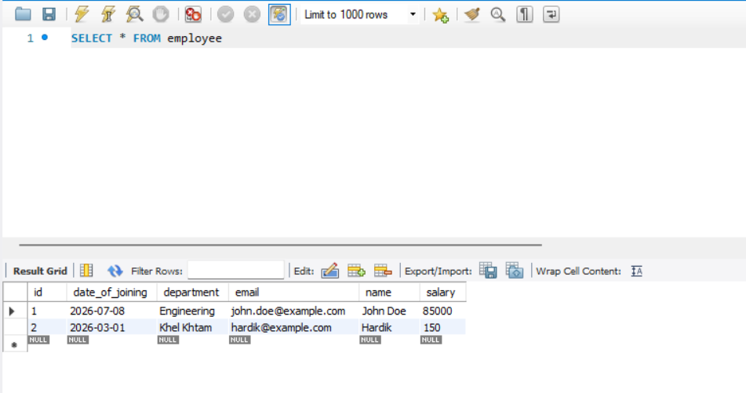
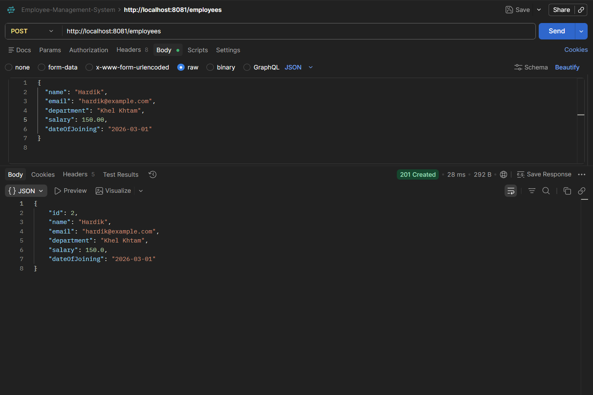
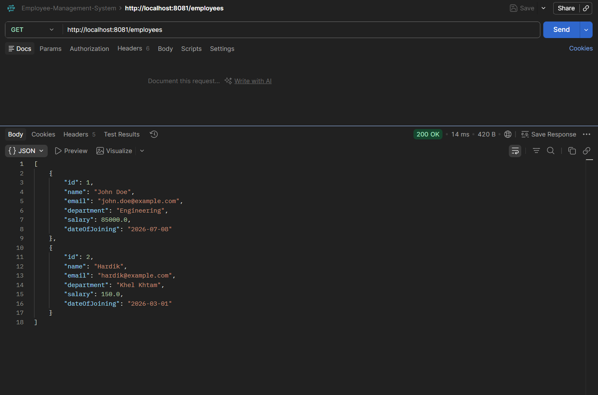
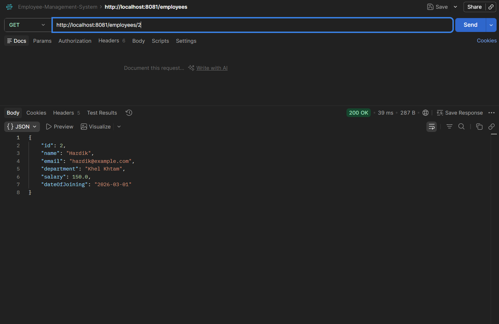
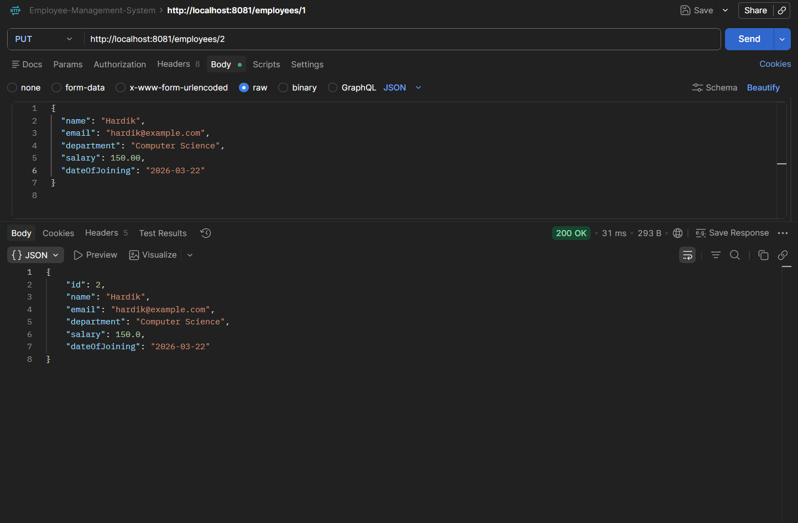
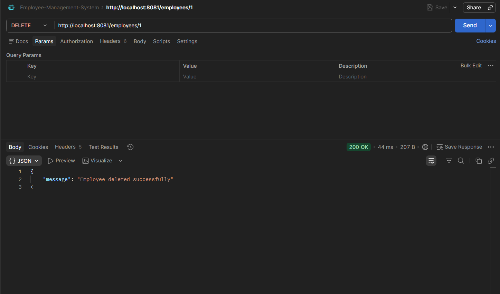

# 💼 Employee Management System

[](https://openjdk.org/)
[](https://spring.io/projects/spring-boot)
[](https://www.h2database.com/)
[](https://maven.apache.org/)

A robust, enterprise-grade Spring Boot RESTful API engineered for managing employee records. This application demonstrates industry-standard practices, including a layered architecture, custom exception handlers, strict input validation, and flexible database persistence configurations.

---

## 🚀 Key Features

*   **Layered Architecture:** Segregated logic using clean Controller, Service, and Repository boundaries.
*   **Comprehensive Validations:** Server-side request validation utilizing Jakarta Bean Validation constraints (`@NotBlank`, `@Email`, `@Positive`, etc.).
*   **Global Exception Handling:** Centralized exception handling mapped to standard HTTP statuses for predictable API responses.
*   **Dual Persistence Profiles:** Seamless switching between in-memory/file-based H2 database for development and MySQL for production.
*   **Visual REST Interface:** Fully tested API endpoints documented with actual screenshots and sample payloads.

---

## 🛠️ Tech Stack

*   **Backend Framework:** Spring Boot 3.3.2
*   **Language:** Java 17
*   **Data Access:** Spring Data JPA (Hibernate)
*   **Validation:** Jakarta Bean Validation API
*   **Databases:** H2 (In-memory/File-based), MySQL
*   **Build Tool:** Maven

---

## 📂 Project Structure

```text
src/main/java/com/system/employee_management
├── controller
│   └── EmployeeController.java      # REST API Endpoints & Request Mapping
├── entity
│   └── Employee.java                # JPA Entity with Validation Constraints
├── exception
│   ├── EmployeeNotFoundException.java # Custom Resource-specific Exception
│   └── GlobalExceptionHandler.java    # Centralized REST Error Handler
├── repository
│   └── EmployeeRepository.java      # JPA Data Access Repository
├── service
│   └── EmployeeService.java         # Business Logic Layer
└── EmployeeManagementApplication.java# Main Application Class
```

---

## 📊 Database Schema (Employee)

The `Employee` resource is defined by the following schema and data constraints:

| Field Name | Data Type | Constraints / Validations | Description |
| :--- | :--- | :--- | :--- |
| **`id`** | `Long` | Primary Key, Auto-Generated | Unique database-generated identifier. |
| **`name`** | `String` | `@NotBlank` (Cannot be empty/null) | Full name of the employee. |
| **`email`** | `String` | `@NotBlank`, `@Email` (Must be unique) | Corporate contact email address. |
| **`department`** | `String` | `@NotBlank` | Assigned organization department. |
| **`salary`** | `Double` | `@Positive` (Must be > 0) | Employee's base salary. |
| **`dateOfJoining`** | `LocalDate` | ISO Date (`yyyy-MM-dd`) | Official starting date. |

---

## 🔌 API Endpoints Reference

Base URL: `http://localhost:8081`

| HTTP Method | Endpoint | Description | Expected Payload | Response Status |
| :--- | :--- | :--- | :--- | :--- |
| **`POST`** | `/employees` | Register a new employee | JSON Object | `201 Created` |
| **`GET`** | `/employees` | Retrieve list of all employees | *None* | `200 OK` |
| **`GET`** | `/employees/{id}` | Find an employee by ID | *None* | `200 OK` / `404 Not Found` |
| **`PUT`** | `/employees/{id}` | Update an existing employee's details| JSON Object | `200 OK` / `404 Not Found` |
| **`DELETE`** | `/employees/{id}`| Remove an employee record by ID | *None* | `200 OK` / `404 Not Found` |

---

## ⚙️ Configuration & Setup

### 1. Prerequisites
*   **Java Development Kit (JDK) 17** or higher
*   **Apache Maven** (or run using the included `./mvnw` wrapper)
*   **Postman** (or any REST client) for endpoint validation

### 2. Database Profiles

#### Option A: File-based H2 Database (Default)
Suitable for rapid testing without external dependencies.
*   **Console URL:** `http://localhost:8081/h2-console`
*   **JDBC URL:** `jdbc:h2:file:./data/employee_db`
*   **User:** `sa` | **Password:** *(empty)*

The H2 configuration in `src/main/resources/application.properties` is active by default:
```properties
spring.datasource.url=jdbc:h2:file:./data/employee_db
spring.datasource.driver-class-name=org.h2.Driver
spring.datasource.username=sa
spring.datasource.password=
spring.jpa.hibernate.ddl-auto=update
```

#### Option B: MySQL Server
For a persistent production-like database setup.
1. Create a MySQL database instance:
   ```sql
   CREATE DATABASE employee_management;
   ```
2. Modify `src/main/resources/application.properties` to connect to MySQL:
   ```properties
   spring.datasource.url=jdbc:mysql://localhost:3306/employee_management
   spring.datasource.username=your_mysql_username
   spring.datasource.password=your_mysql_password
   spring.datasource.driver-class-name=com.mysql.cj.jdbc.Driver
   
   spring.jpa.hibernate.ddl-auto=update
   spring.jpa.show-sql=true
   spring.jpa.properties.hibernate.format_sql=true
   ```

---

## 🏃 Run & Build Guide

Execute the application from the root directory using the Maven wrapper:

### Windows (PowerShell/CMD)
```powershell
.\mvnw.cmd spring-boot:run
```

### Linux / macOS
```bash
./mvnw spring-boot:run
```
The application will bootstrap on port `8081`. You can access the API endpoints immediately.

### Run Tests and Generate Artifacts
```bash
# Execute unit tests
./mvnw test

# Compile and package application into an executable JAR
./mvnw clean package
```

---

## 🧪 Postman Verification & API Testing

Ensure your headers include `Content-Type: application/json` for writing requests.

### 1. Register Employee (`POST`)
*   **Endpoint:** `POST http://localhost:8081/employees`
*   **Request Body:**
    ```json
    {
      "name": "Rahul Sharma",
      "email": "rahul.sharma@example.com",
      "department": "Engineering",
      "salary": 75000,
      "dateOfJoining": "2024-06-10"
    }
    ```

### 2. Retrieve All Records (`GET`)
*   **Endpoint:** `GET http://localhost:8081/employees`

### 3. Fetch Single Employee (`GET`)
*   **Endpoint:** `GET http://localhost:8081/employees/1`

### 4. Update Records (`PUT`)
*   **Endpoint:** `PUT http://localhost:8081/employees/1`
*   **Request Body:**
    ```json
    {
      "name": "Rahul Sharma",
      "email": "rahul.updated@example.com",
      "department": "Management",
      "salary": 90000,
      "dateOfJoining": "2024-06-10"
    }
    ```

### 5. Remove Record (`DELETE`)
*   **Endpoint:** `DELETE http://localhost:8081/employees/1`

---

## ⚠️ Validation and Exception Handling Demos

The API guarantees structured error handling to client requests in case of incorrect input payloads.

### Request Validation Failure
Sending a malformed request body such as:
```json
{
  "name": "",
  "email": "invalid-email",
  "department": "",
  "salary": -5000,
  "dateOfJoining": "2024-06-10"
}
```
Will return a **`400 Bad Request`** with clear, property-specific messages highlighting the validation errors.

### Entity Not Found Scenario
Requesting a resource that does not exist (e.g., `GET /employees/999`) will throw a custom `EmployeeNotFoundException`, resulting in a clean **`404 Not Found`** status with a structured error explanation.

---

## 📸 Endpoint Previews & Execution Logs

<details>
  <summary><b>Click to expand Visual Demos (Screenshots)</b></summary>
  <br/>

  ### 🗄️ Database Console State (H2 Console)
  
  
  <br/>
  <hr/>
  
  ### 📥 POST Request — Create Employee
  
  
  <br/>
  <hr/>
  
  ### 📤 GET Request — Retrieve All Employees
  
  
  <br/>
  <hr/>
  
  ### 🔍 GET Request — Retrieve by ID
  
  
  <br/>
  <hr/>
  
  ### 🔄 PUT Request — Modify Employee
  
  
  <br/>
  <hr/>
  
  ### ❌ DELETE Request — Remove Employee
  

</details>
